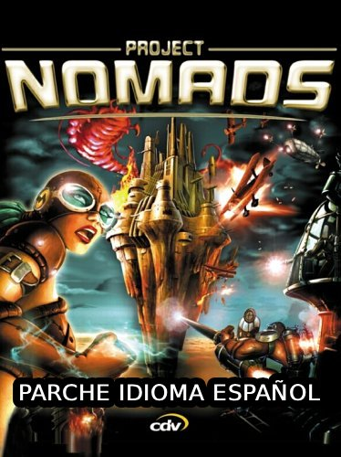

# Traducción al español del juego Project Nomads

<div align="center">
  
</div>

## Descripción

Parche de traducción al español para **Project Nomads** (2002). El proyecto contiene las traducciones de todos los diálogos del juego y las imágenes BMP listas para usar, junto con un instalador que las coloca en el juego con un solo clic.

## Contenido

| Ruta | Descripción |
| --- | --- |
| `src/img_locale/instalar_traduccion.bat` | **Instalador del parche.** Vive dentro de `img_locale/` y copia las imágenes al juego. |
| `src/img_locale/` | Imágenes BMP ya traducidas
| `src/i18n/` | Textos traducidos (fuente de las imágenes). Solo para mantenimiento. |
| `src/imageGenerator.py` | Script Python que genera las imágenes desde los textos. Solo para mantenimiento. |
| `documentation_img/` | Imágenes de apoyo para la documentación. |

---

## Instalación del parche

Esto es todo lo que necesita el jugador. El instalador viene **dentro de la carpeta `img_locale/`**, junto a las imágenes ya listas; solo tienes que copiar esa carpeta al juego y ejecutarlo. Basta con descargar el proyecto (o la carpeta `img_locale` sola, con el `.bat` dentro) y correr el instalador.

### Requisitos

- Windows con el juego **Project Nomads** instalado en `C:\Program Files (x86)\Project Nomads`.

### Opción A — Doble clic (la más fácil)

1. Descarga y descomprime el proyecto (o copia la carpeta `img_locale`, que ya incluye el instalador).
2. Entra en la carpeta `src/img_locale/` y haz doble clic en **`instalar_traduccion.bat`**.
3. Acepta el aviso de **permisos de administrador** (es necesario porque el juego está en `Program Files`).
4. Espera a que termine: verás un resumen con **451 archivos copiados**.

### Opción B — Desde la terminal

Desde la raíz del proyecto:

```bat
src\img_locale\instalar_traduccion.bat
```

O entra en la carpeta y ejecútalo directamente:

```bat
cd src\img_locale
instalar_traduccion.bat
```

### Si el juego está en otra carpeta

Pásale la ruta a la carpeta `book` como argumento:

```bat
src\img_locale\instalar_traduccion.bat "D:\Juegos\Project Nomads\Run\book"
```

O edita la variable `GAME_BOOK` al inicio del archivo `src\img_locale\instalar_traduccion.bat`.

### Qué hace exactamente

El instalador recorre la carpeta `img_locale/` buscando las carpetas `chapterXX/partYY` (esté donde esté dentro de `img_locale/`, aunque estén en `es/`). Cada imagen se copia sobre la carpeta `subtitle` del juego correspondiente:

```
src/img_locale/es/chapter01/part00/omu_c01p00_trevayne01.bmp
        └──> C:\Program Files (x86)\Project Nomads\Run\book\chapter01\part00\subtitle\omu_c01p00_trevayne01.bmp
```

Como se copia toda la carpeta `img_locale`, quedan cubiertos **todos los capítulos** (chapter00, 01, 02, 03, 04 y siguientes).

> **Nota:** el instalador **reemplaza** las imágenes originales del juego (en inglés). Para volver al idioma original, reinstala el juego o restaura los archivos de la carpeta `subtitle` desde una copia.

---

## Cómo funciona (generación de las imágenes)

Solo es relevante si quieres **modificar o traducir nuevos diálogos** (ver [Desarrollo](#desarrollo-opcional)). Cada diálogo vive en un archivo `locale.json` que asocia el nombre de la imagen con su texto:

```json
{
    "omu_c01p00_trevayne01.bmp": "¡Tú! ¿Qué has hecho?",
    "omu_c01p00_trevayne02.bmp": "¡Los Centinelas han establecido un bloqueo!"
}
```

El script `imageGenerator.py` lee esos JSON y genera las imágenes BMP en `src/img_locale/`, replicando la estructura de carpetas de `i18n`.

---

## Desarrollo (opcional)

La parte de Python **no es necesaria para usar el parche**: las imágenes ya están generadas en el repositorio. Solo hace falta si quieres regenerarlas o hacer mantenimiento.

### Puesta en marcha (una sola vez)

El proyecto usa un **entorno virtual** para aislar las dependencias y no depender de lo que tenga instalado tu sistema.

**Importante:** para que los paquetes queden DENTRO del `.venv` y no en tu Python global, debes usar el Python del entorno virtual. Los comandos de abajo ya lo hacen, así que no es necesario "activar" nada.

1. Crea el entorno virtual (desde la raíz del proyecto):

   ```
   python -m venv .venv
   ```

2. Instala las dependencias declaradas en `pyproject.toml` usando el pip del entorno:

   - **Windows / PowerShell**:
     ```
     .\.venv\Scripts\python.exe -m pip install -e ".[dev]"
     ```
   - **Windows / Git Bash (MINGW64)** — usa barras normales `/`, no `\`:
     ```
     .venv/Scripts/python.exe -m pip install -e ".[dev]"
     ```
   - **Linux/macOS**:
     ```
     .venv/bin/python -m pip install -e ".[dev]"
     ```

   - `.[dev]` instala `pillow` (dependencia de ejecución) y `ruff` (dependencia de desarrollo).

> **Alternativa (activando el entorno):** `.\.venv\Scripts\Activate.ps1` y luego `pip install -e ".[dev]"`. Pero si escribes `pip install` **sin haber activado**, se instala en tu Python global.

### Ejecutar el generador

Sin activar nada, desde la raíz del proyecto:

- **Windows / PowerShell**: `.\.venv\Scripts\python.exe src\imageGenerator.py`
- **Windows / Git Bash (MINGW64)**: `.venv/Scripts/python.exe src/imageGenerator.py`
- **Linux/macOS**: `.venv/bin/python src/imageGenerator.py`

O con el entorno activado:

```
image-generator
```

Las imágenes generadas quedan en `src/img_locale/`.

### Lint y formato (ruff)

[Ruff](https://docs.astral.sh/ruff/) es el equivalente a ESLint para Python. Está configurado en `pyproject.toml` (`[tool.ruff]`).

| Comando | Equivalente a | Qué hace |
| --- | --- | --- |
| `ruff check .` | `eslint` | Analiza el código en busca de errores. |
| `ruff check --fix .` | `eslint --fix` | Corrige automáticamente lo corregible (incluye ordenar los imports). |
| `ruff format .` | `prettier` | Formatea el código con estilo consistente. |
| `ruff format --check .` | `prettier --check` | Verifica el formato sin modificar nada. |

> Nota: si el entorno no está activado, usa `.venv\Scripts\ruff.exe` en lugar de `ruff`.

### Solución de problemas

#### "WARNING: The script image-generator.exe is installed in '...pythoncore-3.14-64\Scripts'"

Ese warning significa que instalaste con tu pip global (no con el del `.venv`). Solución: desinstala del entorno global y vuelve a instalar con el Python del venv:

```
python -m pip uninstall -y project-nomads-spanish-patch
.\.venv\Scripts\python.exe -m pip install -e ".[dev]"
```

Verifica dónde quedó cada cosa:

```
python -m pip list                    # entorno global (solo debe salir pip)
.\.venv\Scripts\python.exe -m pip list   # entorno virtual (pillow, ruff, el proyecto)
```

## Cómo traducir

1. Edita los textos en los `locale.json` dentro de `src/i18n/`.
2. Regenera las imágenes con el generador (sección [Desarrollo](#desarrollo-opcional)).
3. Vuelve a ejecutar `src\img_locale\instalar_traduccion.bat` para reemplazar las imágenes del juego.
4. No cambies el nombre de las claves (la parte antes de `:`) ni los archivos: el juego las busca con ese nombre exacto.

Se puede usar `\n` dentro de un texto para forzar un salto de línea.

## Licencia

Este proyecto está bajo la licencia [MIT](LICENSE).
